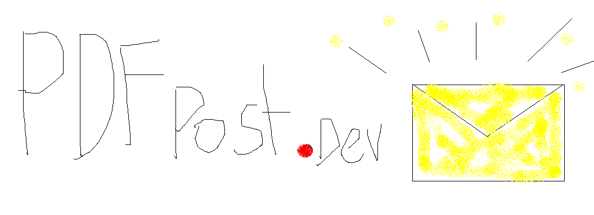
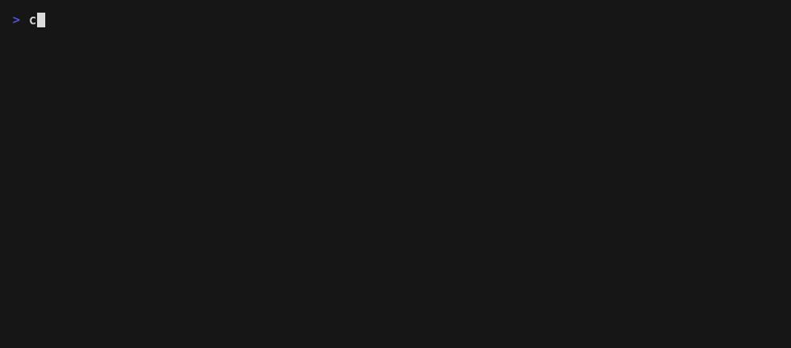

<p align="center">
  
</p>

# PDFPost

**POST JSON, get a pixel-perfect PDF back.** Self-hosted, MIT, no per-document pricing.

[](https://github.com/andyshrx/pdfpost/actions/workflows/tests.yml)
[](LICENSE)
[](https://buymeacoffee.com/andyshrx)

Design a template once in [Liquid](https://shopify.github.io/liquid/), render documents
from any app with one authenticated API call. Invoices, receipts, certificates, reports,
and og-images. Rendering is done by [Gotenberg](https://gotenberg.dev) (headless Chromium),
so what you see in the preview is what lands in the PDF.



## Features

- **Templates with history.** Liquid templates, versioned on every change. A render always
  pins the version it used.
- **A real editor.** CodeMirror editor in the dashboard with a live preview that re-renders
  as you type, plus a one-click test PDF.
- **Sync or async.** `POST /api/v1/render` streams the document back. `POST /api/v1/renders`
  queues it and calls your webhook when done.
- **Signed webhooks.** Every callback is signed with HMAC-SHA256 so receivers can verify it.
- **Expiring artifact links.** Files are served through signed URLs, no API token required
  to download.
- **og-images.** `"format": "png"` renders a 1200x630 social card from the same template.
- **Operator friendly.** API tokens with abilities, per-user rate limiting, automatic
  artifact retention pruning, and an email alert when renders keep failing.

## Quick start (docker compose)

```bash
git clone https://github.com/andyshrx/pdfpost.git && cd pdfpost
cp .env.example .env
docker compose run --rm app php artisan key:generate
docker compose up -d   # pulls the prebuilt image from ghcr
```

Prebuilt multi-arch images (amd64 and arm64) are published to
`ghcr.io/andyshrx/pdfpost` on every release. To build from source instead,
run `docker compose build` first.

That gives you the app on [http://localhost:8080](http://localhost:8080), a queue worker,
a scheduler, and Gotenberg on an internal network. Register an account, seed the template
gallery if you want examples (`docker compose exec app php artisan db:seed`), then mint
an API token:

```bash
docker compose exec app php artisan pdfpost:token my-app
```

<details>
<summary>Running from source instead</summary>

```bash
docker run --rm -d -p 127.0.0.1:3000:3000 gotenberg/gotenberg:8
composer install
cp .env.example .env
php artisan key:generate
touch database/database.sqlite && php artisan migrate
npm install && npm run build
php artisan serve   # plus: php artisan queue:work
```

</details>

## Using the API

Create a template (or use the dashboard editor):

```bash
curl -X POST http://localhost:8080/api/v1/templates \
  -H "Authorization: Bearer $TOKEN" \
  -H 'Content-Type: application/json' \
  -d '{"name":"Invoice","liquid_source":"<h1>Invoice for {{ customer }}</h1><p>Total: {{ total }}</p>"}'
```

Render it with your data:

```bash
curl -X POST http://localhost:8080/api/v1/render \
  -H "Authorization: Bearer $TOKEN" \
  -H 'Content-Type: application/json' \
  -d '{"template":"invoice","data":{"customer":"Acme Co","total":"$462.00"}}' -o invoice.pdf
```

One-off inline HTML works too, and `"format": "png"` returns a 1200x630 og-image instead
of a PDF.

### Async + webhooks

```bash
curl -X POST http://localhost:8080/api/v1/renders \
  -H "Authorization: Bearer $TOKEN" \
  -H 'Content-Type: application/json' \
  -d '{"template":"invoice","data":{"customer":"Acme Co"},"webhook_url":"https://your-app.test/hooks/pdfpost"}'
```

You get a `202` with a render id. Poll `GET /api/v1/renders/{id}`, or wait for the
webhook: the payload carries the status and an expiring signed `artifact_url`, and the
request is signed with HMAC-SHA256 in the `X-PDFPost-Signature` header. Verify it like
this:

```php
$valid = hash_equals(
    hash_hmac('sha256', $request->getContent(), $secret),
    $request->header('X-PDFPost-Signature')
);
```

The secret is `PDFPOST_WEBHOOK_SECRET`, or derived from `APP_KEY` when unset.

## Why not X?

| | PDFPost | Gotenberg | jsreport | Carbone | PDF SaaS APIs |
|---|---|---|---|---|---|
| Templates + data merge | Liquid | no, conversion only | yes | yes | yes |
| Free template count | unlimited | n/a | 5, then $995+/yr | unlimited | pay per doc |
| License | MIT | MIT | LGPL + paid tiers | CCL, no SaaS use | proprietary |
| Self-hosted | yes | yes | partly | yes | no |
| Async + signed webhooks | yes | no | no | no | some |
| og-image endpoint | yes | raw screenshots | no | no | some |
| Editor with live preview | yes | no | yes | no | yes |

Gotenberg is not a competitor, it is the engine. PDFPost is the templating, auth, queue,
and webhook layer that turns it into a document API.

## Security model

- **Single tenant.** Template authors are trusted operators. There is no public rendering
  surface and no multi-tenant isolation (yet).
- **Sandboxed templates.** Liquid cannot execute code, touch the filesystem, or make
  network calls.
- **Contained Chromium.** In the compose setup Gotenberg runs on an internal Docker
  network with no route to the internet, so template content cannot be used to reach
  other services.
- **Signed everything.** Artifact URLs expire, webhook payloads carry an HMAC signature,
  and API tokens are scoped with abilities.

Found a security issue? Please use GitHub's private vulnerability reporting on this
repository rather than opening a public issue.

## Roadmap

Template sharing/import, multi-page report pagination controls, S3 artifact examples,
a hosted demo, and whatever the issues page says people need.

## A note from me

Hi, I'm Andy. I built PDFPost because paying per document to merge JSON into some HTML
never sat right with me, and I wanted a real excuse to go deep on Laravel. Now it does
my own paperwork.

If it is missing something you need, open an issue and tell me about your use case. I am
happy to make updates, and feature requests genuinely make my day.

If PDFPost saves you some money or time, you can
[buy me a coffee](https://buymeacoffee.com/andyshrx). Yes I drew the logo myself.

## License

[MIT](LICENSE)
